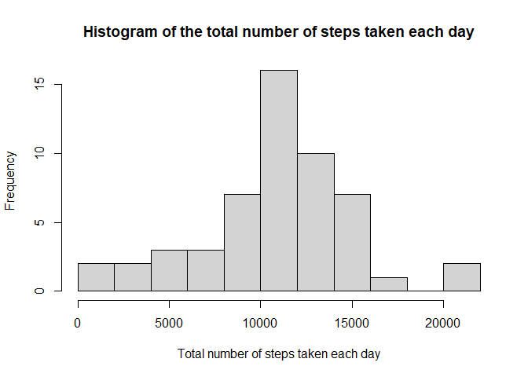
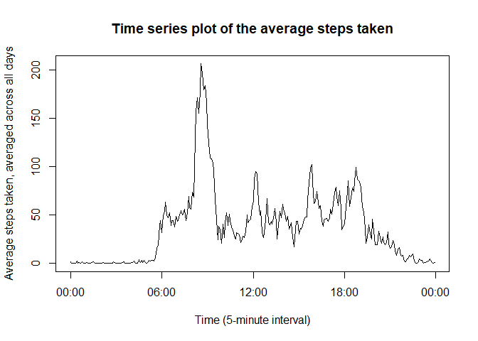
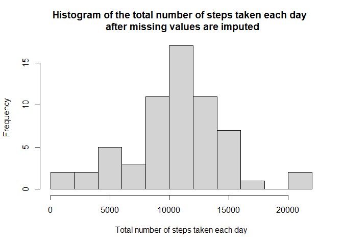
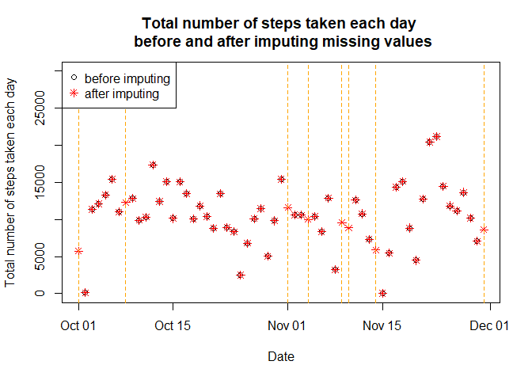
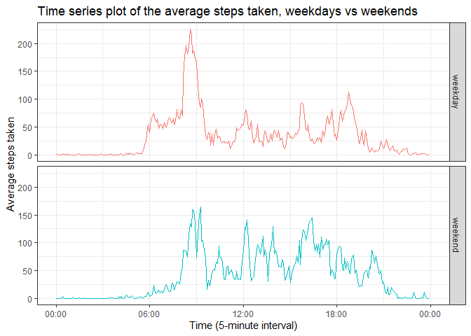

------------------------------------------------------------------------

## **1. Load, set and read**

#### **Load packages and set language of system time**


``` r
library(dplyr)
library(data.table)
library(ggplot2)
Sys.setlocale("LC_TIME","en_US.UTF-8") 
```

#### **Download and read data file**


``` r
setwd("D:/GXY's documents/R/5-ReproducibleResearch/week2")
url <- "https://d396qusza40orc.cloudfront.net/repdata%2Fdata%2Factivity.zip"
download.file(url,"repdata_data_activity.zip",method="curl")
unzip("repdata_data_activity.zip")
data <- read.csv("activity.csv",header=TRUE)
```

------------------------------------------------------------------------

## **2. What is mean total number of steps taken per day?**

#### **Calculate the total number of steps taken per day**


``` r
totalsteps_day <- tapply(data[!is.na(data$steps),]$steps,data[!is.na(data$steps),]$date,sum)
totalsteps_day <- data.frame(date=names(totalsteps_day),totalsteps=totalsteps_day)
```

#### **Plot 1: Histogram of the total number of steps taken each day**


``` r
hist(totalsteps_day$totalsteps,
     breaks=10,
     main="Histogram of the total number of steps taken each day",
     xlab="Total number of steps taken each day")
```

<!-- -->

#### **Calculate and report the mean and median number of total steps taken each day**


``` r
mean(totalsteps_day$totalsteps)
```

```
## [1] 10766.19
```

``` r
median(totalsteps_day$totalsteps)
```

```
## [1] 10765
```

The mean number of total steps taken each day is 1.0766189\times 10^{4}.\
The median number of total steps taken each day is 10765.

------------------------------------------------------------------------

## **3. What is the average daily activity pattern?**

#### **Plot 2: Time series plot of the average number of steps taken (please ignore the "2026-05-09" things, it is like a placeholder for date value which will be eliminated in the final plot)**


``` r
averagesteps_time <- tapply(data[!is.na(data$steps),]$steps,data[!is.na(data$steps),]$interval,mean)
averagesteps_time <- data.frame(interval=names(averagesteps_time),averagesteps=averagesteps_time) 
averagesteps_time <- mutate(averagesteps_time,time=sprintf("%04d",as.integer(interval))) 
averagesteps_time$time <- as.POSIXct(strptime(paste("2026-05-09",averagesteps_time$time),"%Y-%m-%d %H%M")) 
plot(averagesteps_time$time,
     averagesteps_time$averagesteps,
     type="l",
     main="Time series plot of the average steps taken",
     xlab="Time (5-minute interval)",
     ylab="Average steps taken, averaged across all days",
     xaxt="n") 
axis(side=1, 
     at=c(as.POSIXct("2026-05-09 00:00:00"),as.POSIXct("2026-05-09 06:00:00"),as.POSIXct("2026-05-09 12:00:00"),
          as.POSIXct("2026-05-09 18:00:00"),as.POSIXct("2026-05-10 00:00:00")), 
     labels=format(c(as.POSIXct("2026-05-09 00:00:00"),as.POSIXct("2026-05-09 06:00:00"),as.POSIXct("2026-05-09 12:00:00"),
                     as.POSIXct("2026-05-09 18:00:00"),as.POSIXct("2026-05-10 00:00:00")),"%H:%M"))
```

<!-- -->

#### **The 5-minute interval that, on average, contains the maximum number of steps**


``` r
theinterval <- paste(format(as.POSIXct(averagesteps_time[which.max(averagesteps_time$averagesteps),"time"]),"%H:%M"),
                     "-",
                     format(as.POSIXct(averagesteps_time[which.max(averagesteps_time$averagesteps)+1,"time"]),"%H:%M"))
print(theinterval)
```

```
## [1] "08:35 - 08:40"
```

The 5-minute interval that, on average, contains the maximum number of steps is 08:35 - 08:40.

------------------------------------------------------------------------

## **4. Imputing missing values / A strategy for imputing missing data**

#### **Calculate and report the total number of missing values in the dataset**


``` r
sum(is.na(data$steps))
```

```
## [1] 2304
```

The total number of missing values in the dataset is 2304.

#### **Devise a strategy for filling in all of the missing values in the dataset**

The strategy for filling in all of the missing values is using the mean for that 5-minute interval which would be adjusted by the average total steps per day of surrounding 4 days (if data exists) compared to the average total steps per day for all days.

#### **Create a new dataset that is equal to the original dataset but with the missing data filled in**


``` r
data_imputed <- data 
totalsteps_eachday_all <- tapply(data$steps,data$date,sum,na.rm=TRUE)
totalsteps_eachday_all <- data.frame(date=names(totalsteps_eachday_all),totalsteps=totalsteps_eachday_all)
totalsteps_eachday_all[totalsteps_eachday_all$totalsteps==0,]$totalsteps <- NA
for(i in 1:17568){
  if(is.na(data_imputed$steps[i])){
    if(i %% 288==0){
      data_imputed$steps[i] <- averagesteps_time$averagesteps[288] * 
        mean(totalsteps_eachday_all$totalsteps[c(max(0, i %/% 288 - 2), i %/% 288 - 1, i %/% 288 + 1, i %/% 288 + 2)],na.rm=TRUE) / 
        mean(totalsteps_day$totalsteps)
    }
    else{
      data_imputed$steps[i] <- averagesteps_time$averagesteps[i %% 288] * 
        mean(totalsteps_eachday_all$totalsteps[c(max(0, i %/% 288 - 1), i %/% 288, i %/% 288 + 2, i %/% 288 + 3)],na.rm=TRUE) / 
        mean(totalsteps_day$totalsteps)
    }
  }
}
```

#### **Plot 3: Histogram of the total number of steps taken each day after missing values are imputed**


``` r
totalsteps_day_imputed <- tapply(data_imputed$steps,data_imputed$date,sum) 
totalsteps_day_imputed <- data.frame(date=names(totalsteps_day_imputed),totalsteps=totalsteps_day_imputed) 
hist(totalsteps_day_imputed$totalsteps,
     breaks=10,
     main="Histogram of the total number of steps taken each day \n after missing values are imputed",
     xlab="Total number of steps taken each day")
```

<!-- -->

#### **Report the mean and median total number of steps taken per day**


``` r
mean(totalsteps_day_imputed$totalsteps)
```

```
## [1] 10543.69
```

``` r
median(totalsteps_day_imputed$totalsteps)
```

```
## [1] 10571
```

The mean number of total steps taken each day is 1.0543693\times 10^{4}.\
The median number of total steps taken each day is 1.0571\times 10^{4}.\
Both mean and median numbers become a little bit lower than before.


``` r
plot(as.POSIXct(totalsteps_eachday_all$date),
     totalsteps_eachday_all$totalsteps,
     main="Total number of steps taken each day \n before and after imputing missing values",
     xlab="Date",
     ylab="Total number of steps taken each day",
     ylim=c(0,30000))
points(as.POSIXct(totalsteps_day_imputed$date),
       totalsteps_day_imputed$totalsteps,
       pch=8,
       col="red")
abline(v=as.POSIXct(c("2012-10-01","2012-10-08","2012-11-01","2012-11-04","2012-11-09","2012-11-10","2012-11-14","2012-11-30")),
       col="orange",
       lty=2)
legend("topleft",pch=c(1,8),col=c("black","red"),legend=c("before imputing","after imputing"))
```

<!-- -->

After imputing the missing values, 8 days with all NA records are filled with simulated values. The accuracy depends on the imputing strategy used, but in general it does not affect too much on the estimates of the total daily number of steps.


``` r
summary(totalsteps_day$totalsteps)
```

```
##    Min. 1st Qu.  Median    Mean 3rd Qu.    Max. 
##      41    8841   10765   10766   13294   21194
```

``` r
summary(totalsteps_day_imputed$totalsteps)
```

```
##    Min. 1st Qu.  Median    Mean 3rd Qu.    Max. 
##      41    8821   10571   10544   12811   21194
```

------------------------------------------------------------------------

## **5. Are there differences in activity patterns between weekdays and weekends?**

#### **Create a new factor variable in the dataset with two levels – “weekday” and “weekend” indicating whether a given date is a weekday or weekend day**


``` r
data_imputed$date <- as.POSIXct(data_imputed$date) 
data_imputed <- mutate(data_imputed, day=weekdays(data_imputed$date))
data_imputed[data_imputed$day %in% c("Monday","Tuesday","Wednesday","Thursday","Friday"),]$day <- "weekday"
data_imputed[data_imputed$day %in% c("Saturday","Sunday"),]$day <- "weekend"
data_imputed$day <- factor(data_imputed$day,levels=c("weekday","weekend"))
```

#### **Plot 4: Panel plot comparing the average number of steps taken per 5-minute interval across weekdays and weekends: Make a panel plot containing a time series plot (i.e.type = "l") of the 5-minute interval (x-axis) and the average number of steps taken, averaged across all weekday days or weekend days (y-axis)**


``` r
data_imputed_time_day <- group_by(data_imputed,day,interval) 
averagesteps_time_day_imputed <- as.data.table(summarize(data_imputed_time_day,mean(steps))) 
names(averagesteps_time_day_imputed)[3] <- "averagesteps" 
averagesteps_time_day_imputed <- mutate(averagesteps_time_day_imputed,time=sprintf("%04d",as.integer(interval))) 
averagesteps_time_day_imputed$time <- as.POSIXct(strptime(paste("2026-05-09",averagesteps_time_day_imputed$time),"%Y-%m-%d %H%M")) 
ggplot(averagesteps_time_day_imputed,aes(time,averagesteps,colour=day))+
  geom_line(show.legend=FALSE)+
  facet_grid(day~.)+
  theme_bw()+
  ggtitle("Time series plot of the average steps taken, weekdays vs weekends")+
  xlab("Time (5-minute interval)")+
  ylab("Average steps taken")+
  scale_x_datetime(limits=c(as.POSIXct("2026-05-09 00:00:00"),as.POSIXct("2026-05-10 00:00:00")),
                   breaks=c(as.POSIXct("2026-05-09 00:00:00"),as.POSIXct("2026-05-09 06:00:00"),as.POSIXct("2026-05-09 12:00:00"),
                            as.POSIXct("2026-05-09 18:00:00"),as.POSIXct("2026-05-10 00:00:00")),
                   date_labels="%H:%M")
```

<!-- -->
